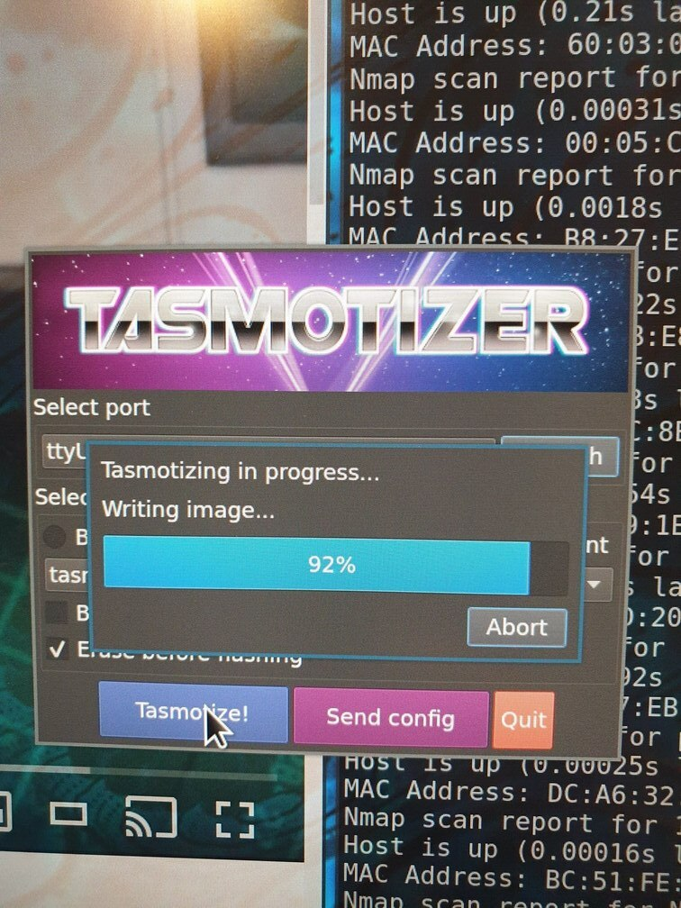

# Tasmotizing

A few random notes about flashing my Sonof plugs and switches with the Tasmoto
firmware.

I'm using this USB->232 converter I had laying arround, most important is to
make sure the data and Vcc is set to 3.3V, not 5V. Notice this particular
device has a bridge set to 3.3V. I also used the 3.3 Vcc pin.

| Pin        | Color  |
| ---        | ---    |
| Vcc (3.3v) | Red    |
| TX         | Green  |
| RX         | Yellow |
| GND        | Brown  |

The device came with 90 degree 1'' male pin headers soldered on, so I used 4
female to female dupont cables with a 4 pin make header on the other side. The 4
pin male I just stuck into the target device's un-populated holes when
programming. 

Install tasmotizer in a Python venv

To program:

* start tasmotizer
* press the on-board button
* stick the header into the holes
* Hit the program button, be sure to keep the header in place until the programming is done, takes ~30s

