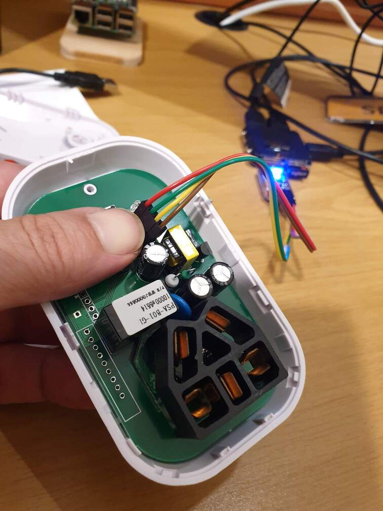
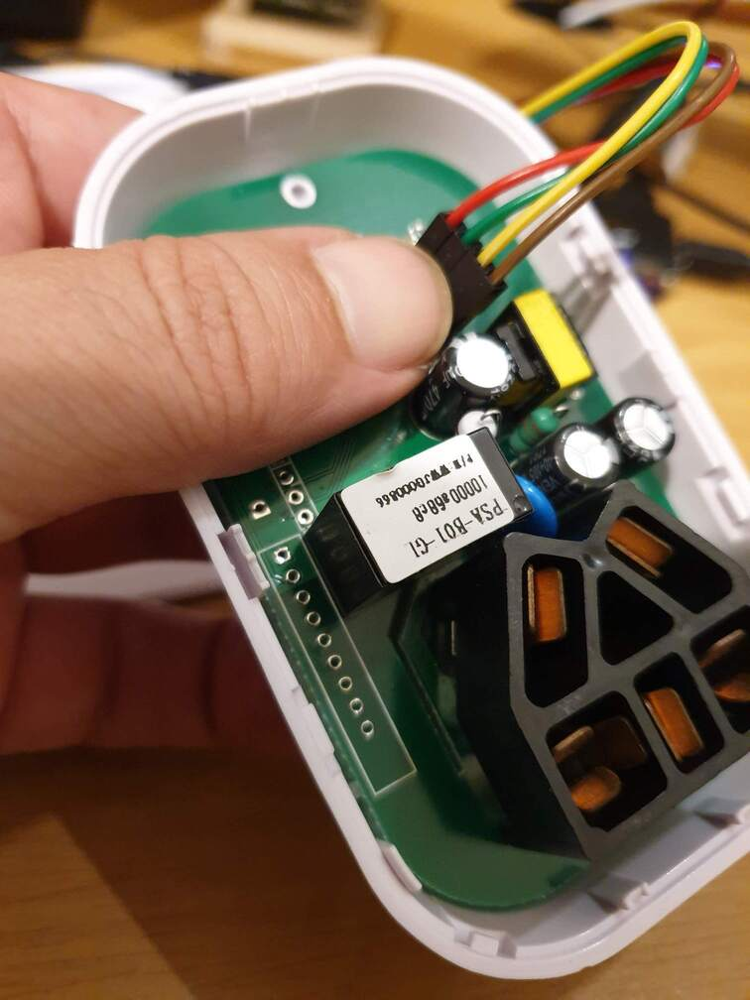

# Tasmotizing

A few random notes about flashing my Sonof plugs and switches with the Tasmoto
firmware.

I'm using this USB->232 converter I had laying around


Most important is to make sure the data and Vcc is set to 3.3V, not 5V. Notice
this particular device has a bridge set to 3.3V. I also used the 3.3 Vcc pin.

The device came with 90 degree 1'' male pin headers soldered on, so I used 4
female to female dupont cables with a 4 pin make header on the other side. The 4
pin male I just stuck into the target device's un-populated holes when
programming. 

I used more or less sensible colors on the USB2ttl side

| Pin        | Color  |
| ---        | ---    |
| Vcc (3.3v) | Red    |
| TX         | Green  |
| RX         | Yellow |
| GND        | Brown  |

On the Sonof switch side the TX and RX pins are swapped, so the colors stay the
same

| Pin        | Color  |
| ---        | ---    |
| Vcc (3.3v) | Red    |
| RX         | Green  |
| TX         | Yellow |
| GND        | Brown  |


I prefer installing tasmotizer in a Python venv:

```
$ python -m venv tasmotizer
$ source ./tasmotizer/bin/activate
$ pip install tasmotizer
```

Using `pipx` would probably been 2 steps less, assuming its already installed:

```
$ pipx tasmotizer
```

# Programming the device

* start tasmotizer
* press the on-board button to set the switch in programming mode
* stick the header into the holes, bending them slightly to get a friction fit
* let the device programming button go, be sure to keep the other male pin headers tight
* Hit the tasmotizer program button, select `release binary`
* be sure to keep the header in place until the programming is done, takes ~30s







# Config device

After flashing:

* close device up
* plug into socket
* wait for circle LED to flash green
* press button 4 times
* connect to device AP, will be named something like `sonof-6666`
* connect to device on `http://192.168.4.1`
* do a scan on the device for local wireless networks and fill in the form
* reboot device

Now the device should be connected ti your local WiFi, to find it do a nmap search on your local subnet, I use 10.0.0.0/24:

```
$ sudo nmap -sn 10.0.0.0/24
...
Nmap scan report for tasmota-0154 (10.0.0.230)
Host is up (0.15s latency).
MAC Address: 5C:CF:7F:3C:50:8C (Espressif)
...
```

Connect to the device and set it up.

# Resources

* https://github.com/tasmota/tasmotizer
* https://tasmota.github.io/docs/#/
